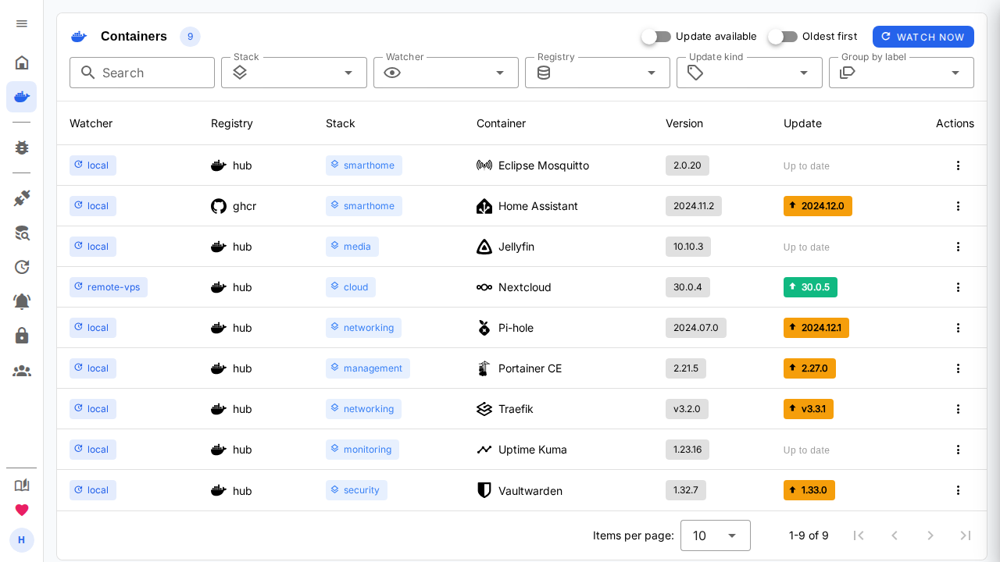
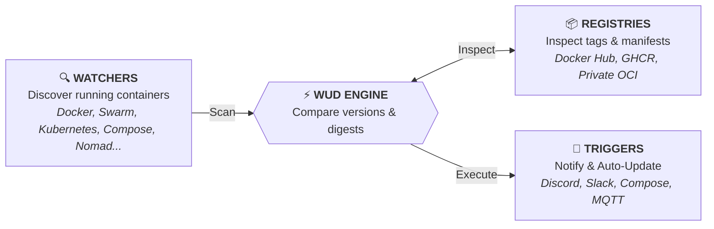

<div align="center">


# What's Up Docker? (WUD)

### *Keep your containers up-to-date across any orchestrator, automatically and effortlessly.*

[](https://hub.docker.com/r/getwud/wud)
[](https://github.com/getwud/wud/stargazers)
[](https://github.com/getwud/wud/actions/workflows/ci.yml)
[](https://github.com/getwud/wud/blob/main/LICENSE)
[](https://getwud.app/)
[](https://github.com/sponsors/fmartinou)
[](https://www.buymeacoffee.com/61rUNMm)
[](https://www.paypal.com/donate/?business=ZSDMEC3ZE8DQ8&no_recurring=0&currency_code=EUR)

<p align="center">
  
  
  
  
  
</p>

<p align="center">
  <a href="https://getwud.app/"><b>📖 Documentation</b></a> •
  <a href="https://getwud.app/docs/quickstart/"><b>🚀 Quick Start</b></a> •
  <a href="https://getwud.app/docs/configuration/"><b>⚙️ Configuration</b></a> •
  <a href="https://getwud.app/docs/configuration/triggers/"><b>🔔 Triggers</b></a> •
  <a href="https://getwud.app/docs/configuration/registries/"><b>📦 Registries</b></a> •
  <a href="CONTRIBUTING.md"><b>🛠️ Contributing</b></a> •
  <a href="https://github.com/getwud/wud/issues"><b>💬 Issues & Support</b></a>
</p>

---

</div>

<p align="center">
  
</p>

---

## 🇨🇳 简体中文汉化分支说明

> **English:** this is a Simplified-Chinese localization fork of [getwud/wud](https://github.com/getwud/wud).
> Prebuilt image: `ghcr.io/dc1024/wud_zh:latest` (public) on branch `i18n-zh`. The UI defaults to Chinese and ships a
> built-in 中文 / English switch; switching to English reproduces the upstream wording verbatim. The localization
> itself only touches `ui/`; the one backend addition is the **watch list** feature (`app/`), which lets you choose
> from the web UI which containers WUD must monitor, stored in a new `watched_containers` table. Every upstream
> environment variable, trigger, volume and REST API behaviour is preserved.

> **本仓库是 [getwud/wud](https://github.com/getwud/wud) 的简体中文本地化分支（fork）。**
> 上游版权与许可是 [MIT](LICENSE)，本分支的全部改动同样以 MIT 发布。

| | |
|---|---|
| 分支 | **`i18n-zh`** |
| 仓库名 | **`DC1024/wud_zh`**（原名 `DC1024/wud`，已更名；镜像同步改为 `ghcr.io/dc1024/wud_zh`） |
| 预构建镜像 | **`ghcr.io/dc1024/wud_zh:latest`**（公开，无需登录即可拉取） |
| 基于上游版本 | `9.1.0` |
| 改动规模 | 41 个文件，+2957 / −267（主体是 `ui/` 前端；另含一项后端增强「监控清单」，向后兼容、不改上游行为） |

### 🚀 直接使用汉化镜像

把上游镜像名换成 `ghcr.io/dc1024/wud_zh:latest` 即可，**环境变量、触发器、卷映射、REST API 行为与上游完全一致**（只是多出「监控清单」的两个新增接口，纯增量，见下文）：

```bash
docker run -d \
  --name wud \
  -p 3000:3000 \
  -e WUD_AUTH_ADMIN_USER="admin" \
  -e WUD_AUTH_ADMIN_PASSWORD="MySecurePassword123" \
  -v /var/run/docker.sock:/var/run/docker.sock \
  ghcr.io/dc1024/wud_zh:latest
```

Docker Compose 同理，只改一行：

```diff
 services:
   wud:
-    image: getwud/wud:latest
+    image: ghcr.io/dc1024/wud_zh:latest
```

### 🌐 语言切换

界面**默认简体中文**，可随时切回英文：

| 入口 | 说明 |
|---|---|
| **侧边栏底部「🌐 语言」** | 已登录时的入口。侧栏收起时显示为带悬浮提示的图标；展开时显示为列表项，右侧标注当前语言（中文 / English） |
| **登录页卡片上方** | 未登录状态也能切换（`中文` / `English`） |

选择会记在浏览器 `localStorage`（键名 `wud-lang`），刷新与重新登录都保持；同时自动同步文档 `<html lang>`，以及 Vuetify 内置文案（表格分页、空状态等）也都跟随切换。

### 📋 与原项目相比改了什么

改动绝大部分在前端 UI 层（汉化 + 语言切换），另加一项后端增强：**监控清单**（网页勾选要监控哪些容器）。后端改动是纯增量的——新表、新接口、新的判定优先级，不改变上游原有的环境变量、触发器与 REST API 行为，因此升级/回退仍只需换镜像名。

**新增文件**

| 文件 | 作用 |
|---|---|
| `ui/src/i18n/index.ts` | i18n 入口：默认语言、读写 `wud-lang`、导出 `currentLocale` / `setLocale()`、同步 `<html lang>` |
| `ui/src/i18n/zh-CN.ts` | 简体中文消息包（15 个命名空间 / 279 条） |
| `ui/src/i18n/en.ts` | 英文消息包（与中文包键位对称，279 条） |
| `ui/src/views/WatchlistView.vue` | 监控清单页面（列表 + 勾选 + 来源标识 + 待生效提示） |
| `ui/src/services/mock/data/discovered.ts` | 监控清单页的演示数据（复刻三态语义） |
| `app/store/watchPreference.ts` | 监控偏好读写层（`watched_containers` 表，三态语义 + fail-safe） |
| `app/store/watchPreference.test.ts` | 上述 store 的单元测试（11 个用例） |
| `.github/workflows/docker-image.yml` | push 到 `i18n-zh` 时自动构建并推送 GHCR 镜像 |

**修改文件**

| 文件 | 改动 |
|---|---|
| `ui/src/main.ts` | 挂载 vue-i18n 实例 |
| `ui/src/plugins/vuetify.ts` | 启用 Vuetify `zhHans` 本地化，并让内置文案跟随语言 |
| `ui/src/App.vue` | 语言变化时同步 Vuetify 的语言环境 |
| `ui/public/index.html` | `<html lang="en">` → `"zh-CN"` |
| `ui/package.json` | 新增依赖 `vue-i18n` |
| `ui/src/router/index.ts`、`ui/src/components/NavigationDrawer.vue` | 注册 `/watchlist` 路由与侧栏入口 |
| `ui/src/services/container.ts`、`ui/src/services/mock/index.ts` | 发现接口与偏好接口的前端调用（含 demo 分支） |
| `app/api/container.ts` | 新增 `GET /api/containers/discover`（列出全部容器，含未监控）与 `PUT /api/containers/watch-preference`（设置/清除偏好） |
| `app/store/db/migrations.ts`、`app/store/db/schema.ts` | 新增 `watched_containers` 表（迁移 id=5） |
| `app/watchers/providers/docker/Docker.ts` | 监控判定改为三优先级，新增 `discoverContainers()` |
| `Dockerfile` | UI 构建阶段 `npm ci` → `npm install`（`package-lock.json` 未包含新依赖） |
| `ui/src/views/*`、`ui/src/components/*` | 共 17 个界面文件，硬编码文案改为 `$t()` |
| `app/registries/providers/hub/Hub.ts` | **Docker Hub 镜像源可配置**：`url`/`authurl`/`service` 改为可经环境变量覆盖；默认字节级保持原生 `registry-1.docker.io`，存量部署零影响 |
| `app/registries/providers/hub/Hub.test.ts` | 新增 3 个镜像源配置用例（匿名镜像站 / 认证镜像站 / 镜像名去 host 前缀），共 27 用例通过 |

**已汉化的界面**

- 导航侧边栏、顶部栏、登录页
- 首页仪表盘（容器数 / 触发器 / 监视器 / 镜像仓库统计）
- 容器列表（含筛选、分组、暂缓更新、删除确认等弹窗）
- 容器详情抽屉全部子页：更新、触发器、镜像、容器信息、错误
- 配置页：触发器、监视器、服务器与系统配置
- **监控清单（本分支新增页面）**：容器选择、来源标识、待生效提示

**仍保留英文的页面**（上游次要页面，尚未翻译）

日志（Logs）、个人资料（Profile）、镜像仓库（Registries）、认证（Authentications）、用户（Users）、状态（State）。
> 这些页面功能完全正常，只是文案还是英文。欢迎按下面的方式补充翻译。

### 🎛 监控清单：在网页上勾选要监控哪些容器

上游 WUD 只能通过 `wud.watch` **标签**决定监控哪些容器（`watchbydefault` 控制未打标签的默认值），改一次就要改 compose 并重建容器。本分支加了一个页面，可以直接在网页上勾选。

**判定优先级（三态，标签永远最高）**

| 优先级 | 来源 | 说明 |
|---|---|---|
| 1 | `wud.watch` 标签 | 基础设施即代码的写法，**始终优先**。打了标签的容器在页面上是锁定的，想用页面控制就得先去掉标签 |
| 2 | 网页勾选（手动偏好） | 存在数据库里，键为 `(watcher, 容器名)`；**按名字而不是容器 ID**，因为容器重建后 ID 会变、名字不会 |
| 3 | `watchbydefault` | 都没设置时沿用监视器默认值。**数据库里没有记录 ≠ false**，否则老实例一升级就会集体停止监控 |

**接口**

```
GET  /api/containers/discover          列出监视器上的全部容器（含未监控），返回 watched 与 watchedBy
PUT  /api/containers/watch-preference  设置偏好：{"watcher","name","watched"}；watched 传 null 表示清除、回落默认
```

`discover` 只做 `docker list`，不查镜像/仓库，所以刷新很快；勾选后偏好**在下一次扫描时生效**，页面会提示"立即生效"按钮（等价于手动触发一次扫描）。

### 🪞 Docker Hub 镜像源可配置（绕过网络封锁）

上游 WUD 的 Hub provider 把镜像仓库地址**硬编码**为 `registry-1.docker.io`、`auth.docker.io/token`、`service=registry.docker.io`。在部分网络（如国内出口、企业防火墙）下，这条链路会被 RST 重置（`ECONNRESET`），导致所有 Docker Hub 容器大面积报 `Error`、无法检测更新——而 GHCR、ECR 等其他源却正常。

本分支让 Hub 的三个字段可通过环境变量覆盖，**默认值时与上游逐字一致**，因此存量部署零影响，只在需要时配置镜像站。

**三种配置语义**

| 环境变量 | 作用 | 何时需要 |
|---|---|---|
| `WUD_REGISTRY_HUB_URL` | 镜像仓库 API 基址（manifest / tags 拉取地址） | 想走镜像站时必填 |
| `WUD_REGISTRY_HUB_AUTHURL` | token 端点（默认 `https://auth.docker.io/token`） | **匿名**镜像站不填；**认证**镜像站填其 token 地址 |
| `WUD_REGISTRY_HUB_SERVICE` | token 的 `service` 参数（默认 `registry.docker.io`） | 认证镜像站且 service 非默认值才填 |

- **匿名镜像站**（推荐，如 `docker.1panel.live`）：只设 `WUD_REGISTRY_HUB_URL`。此时 `authurl` 缺省 → 不发 `Authorization` 头、也不拉 token，直接匿名拉 manifest / tags。
- **认证镜像站**：同时设 `WUD_REGISTRY_HUB_URL` + `WUD_REGISTRY_HUB_AUTHURL`，必要时补 `WUD_REGISTRY_HUB_SERVICE`，走其 token 端点鉴权。

**为什么选 `docker.1panel.live` 而非 daocloud**：daocloud 镜像站（`docker.m.daocloud.io`）禁用了 `tags/list` 接口（返回 401 `disable-list-tags`），而 WUD 依赖该接口做 semver 版本发现，禁用后会破坏更新检测；`docker.1panel.live` 匿名可用且完整返回 `tags/list`，因此本分支默认示例用 1panel。

**使用方式（Docker Compose 示例）**

```yaml
services:
  wud:
    image: ghcr.io/dc1024/wud_zh:latest
    container_name: wud
    ports:
      - "3000:3000"
    environment:
      - WUD_AUTH_ADMIN_USER=admin
      - WUD_AUTH_ADMIN_PASSWORD=MySecurePassword123
      # --- Docker Hub 镜像：绕过出口封锁（匿名镜像站，无需 authurl）---
      - WUD_REGISTRY_HUB_URL=https://docker.1panel.live
    volumes:
      - /var/run/docker.sock:/var/run/docker.sock
    restart: unless-stopped
```

> 只改这一行环境变量即可；其余 `watch` 标签、`WUD_REGISTRY_HUB_*` 之外的配置全部沿用上游。镜像站可换成你信任的任意公共/私有 OCI 代理，只要它完整实现 `manifest` 与 `tags/list`。

### ✅ 英文模式与原版逐字一致

切回 English 时看到的文案**就是上游原文**，不是"回译的英文"。这一点有脚本核对：逐个回查上游源码，219 个键里 **196 条与上游逐字相同**（含大小写与标点），其余 23 条是本分支新增——语言切换按钮 2 条，监控清单页面 21 条（上游并没有这个页面）。

为此还修正过 4 处汉化过程中产生的偏差，例如：登录按钮应还原为上游的 `Login`、复制提示需保留上游 `xxx copied to clipboard` 的类别前缀、暂缓弹窗正文应为 `Snooze update for <名称>:`。

### 🛠 补充/修改翻译

1. 在 `ui/src/i18n/zh-CN.ts` 和 `ui/src/i18n/en.ts` 中**同时**添加键（两份必须键位对称）
2. 在对应 `.vue` 里把硬编码文案换成 `$t('命名空间.键')`（模板里用 `$t(...)`，Options API 的方法里用 `this.$t(...)`）
3. 提交并推送到 `i18n-zh`，GitHub Actions 会自动重建镜像并覆盖 `latest` 标签

**约定**：`en.ts` 的值必须与上游原文逐字一致；中文按语义自然表达，不要逐字直译。

### 📦 镜像构建与发布

- 由 GitHub Actions 在 push `i18n-zh` 时自动构建（约 1~3 分钟），推送到 GHCR，标签为 `latest` 与 `sha-<commit>`
- 构建时把 `WUD_VERSION` 固定写为 `wud_zh-beta1.4`（见 `.github/workflows/docker-image.yml`），因此界面显示的版本是 `wud_zh-beta1.4`。版本号规则：无新功能则维持，有实质更新则最后一位 +0.1（1.0 → 1.1 → 1.2 → 1.3 → 1.4）
- 也可在仓库 **Actions → Build and push WUD (zh-CN) image → Run workflow** 手动触发
- 需要 arm64 等多架构时，在 workflow 的构建步骤加上 `platforms: linux/amd64,linux/arm64`

### 🔄 同步上游更新

```bash
git remote add upstream https://github.com/getwud/wud.git
git fetch upstream
git switch i18n-zh
git merge upstream/main        # 或 git rebase upstream/main
```

合并时冲突主要集中在被翻译过的 `.vue` 文件；`ui/src/i18n/*` 基本不会冲突（上游没有 i18n 框架）。上游新增的界面文案不会自动被翻译，需按上面的方式补键。

「监控清单」碰过的后端文件（`app/api/container.ts`、`app/store/db/{migrations,schema}.ts`、`app/watchers/providers/docker/Docker.ts`）在上游更新时**可能有冲突**，注意三点：迁移要保留自己的 `id`、静态路由要留在 `/:id` 之前、监控判定要保持"标签 > 偏好 > 默认"的三优先级。其余后端文件均未改动。

---

## 💡 About WUD

**WUD (What's Up Docker?)** is a lightweight, proactive container update monitoring and automation tool. It continuously scans your container environments, detects image updates across public and private registries, performs semantic version analysis, and alerts you via your favorite notification channels—or triggers automatic container updates seamlessly.



---

## ✨ Features

- 🔍 **Multi-Orchestrator Engine**  
  Monitor standalone Docker daemons, remote Docker engines over TLS, Docker Compose setups, **Docker Swarm clusters**, native **Kubernetes clusters** (Deployments, StatefulSets, DaemonSets, CronJobs), or **HashiCorp Nomad** clusters.
- 📦 **Multi-Registry Integration**  
  Zero-config & authenticated support for **Docker Hub**, **GitHub Container Registry (GHCR)**, **AWS ECR**, **Google GCR/GAR**, **Azure ACR**, **Quay**, **GitLab**, **Gitea**, **Forgejo**, **Codeberg**, **LinuxServer (LSCR)**, and any custom/self-hosted OCI registry.
- 🔔 **30+ Notification & Automation Triggers**  
  Discord, Matrix, Mattermost, Zulip, Telegram, Slack, Signal, WhatsApp, Bark, Prowl, Home Assistant, Gotify, Ntfy, Pushover, Apprise, Webhooks, Kafka, AMQP/RabbitMQ, NATS, Opsgenie, PagerDuty, Uptime Kuma, GitHub Actions, GitLab CI, SMTP email, shell scripts, and native Docker / Compose / Nomad auto-updaters.
- 🔄 **Automated Container Updates**  
  Automatically pull new images and recreate containers on demand (Docker, Docker Compose, Nomad).
- 🏷️ **SemVer & Tag Filtering**  
  Flexible versioning strategies: target `semver` (major, minor, patch), match custom regular expressions, pin versions, or define include/exclude tag rules.
- 🖥️ **Interactive Web UI & REST API**  
  Clean, responsive web dashboard to inspect container statuses, trigger manual update checks, and query data via a full-featured REST API.
- 📊 **Prometheus & Grafana Ready**  
  Built-in Prometheus `/metrics` endpoint and pre-built Grafana dashboards for observability.
- 🔒 **Enterprise-Grade Authentication & RBAC**  
  Role-Based Access Control (`admin`, `rw`, `ro`), database-backed user management, personal API tokens, and single sign-on with **OpenID Connect (OIDC)** (Keycloak, Authentik, Authelia, etc.) or local accounts.

---

## ⚡ Quick Start

### 1. Run with Docker

```bash
docker run -d \
  --name wud \
  -p 3000:3000 \
  -e WUD_AUTH_ADMIN_USER="admin" \
  -e WUD_AUTH_ADMIN_PASSWORD="MySecurePassword123" \
  -v /var/run/docker.sock:/var/run/docker.sock \
  getwud/wud:latest
```

### 2. Run with Docker Compose

```yaml
services:
  whatsupdocker:
    image: getwud/wud:latest
    container_name: wud
    ports:
      - "3000:3000"
    environment:
      - WUD_AUTH_ADMIN_USER=admin
      - WUD_AUTH_ADMIN_PASSWORD=MySecurePassword123
    volumes:
      - /var/run/docker.sock:/var/run/docker.sock
    restart: unless-stopped
```

> 🌐 **Access the Web UI**: Open [`http://localhost:3000`](http://localhost:3000) in your browser (login with `admin` / `MySecurePassword123`).

---

## 🧩 Supported Integrations

### 🔍 Watchers & Orchestrators
| Environment | Supported Workloads | Configuration Guide |
| :--- | :--- | :---: |
| [**Docker**](https://getwud.app/docs/configuration/watchers/) | Local socket, Remote TCP over TLS, Docker Compose | Built-in (Active by default) |
| [**Docker Swarm**](https://getwud.app/docs/configuration/watchers/swarm/) | Services, Stacks, Replicated & Global workloads | Socket / Remote TCP over TLS |
| [**Kubernetes**](https://getwud.app/docs/configuration/watchers/kubernetes/) | Deployments, StatefulSets, DaemonSets, CronJobs | In-cluster RBAC / Kubeconfig |
| [**Nomad**](https://getwud.app/docs/configuration/watchers/nomad/) | Jobs (`service`, `batch`, `system`), Task Groups | HTTP API / ACL Token |

### 📦 Registries
| Registry | Description | Authentication |
| :--- | :--- | :---: |
| [**Docker Hub**](https://getwud.app/docs/configuration/registries/hub/) | Public and private Docker Hub images | Anonymous / Token / Password |
| [**Docker Hardened Images (DHI)**](https://getwud.app/docs/configuration/registries/dhi/) | Docker Hardened Images (`dhi.io`) | Token / Password |
| [**GitHub (GHCR)**](https://getwud.app/docs/configuration/registries/ghcr/) | GitHub Container Registry packages | Personal Access Token |
| [**AWS ECR**](https://getwud.app/docs/configuration/registries/ecr/) | Amazon Elastic Container Registry | AWS IAM Keys / IAM Roles |
| [**Google GCR / Artifact Registry**](https://getwud.app/docs/configuration/registries/gcr/) | GCP Container & Artifact Registry | Service Account Key (JSON) |
| [**Azure ACR**](https://getwud.app/docs/configuration/registries/acr/) | Azure Container Registry | Service Principal / Admin Secret |
| [**GitLab Registry**](https://getwud.app/docs/configuration/registries/gitlab/) | GitLab Container Registry | Deploy Token / PAT |
| [**Quay.io**](https://getwud.app/docs/configuration/registries/quay/) | Red Hat Quay | Robot Account / OAuth Token |
| [**Self-Hosted / OCI**](https://getwud.app/docs/configuration/registries/custom/) | Harbor, Nexus, Artifactory, Gitea, Forgejo, Codeberg | Basic Auth / Bearer Token |

### 🔔 Triggers & Notifications
| Category | Supported Channels |
| :--- | :--- |
| **Chat & Messaging** | [Discord](https://getwud.app/docs/configuration/triggers/discord/), [Matrix](https://getwud.app/docs/configuration/triggers/matrix/), [Mattermost](https://getwud.app/docs/configuration/triggers/mattermost/), [Signal](https://getwud.app/docs/configuration/triggers/signal/), [Telegram](https://getwud.app/docs/configuration/triggers/telegram/), [Slack](https://getwud.app/docs/configuration/triggers/slack/), [Rocket.Chat](https://getwud.app/docs/configuration/triggers/rocketchat/), [WhatsApp](https://getwud.app/docs/configuration/triggers/whatsapp/), [Zulip](https://getwud.app/docs/configuration/triggers/zulip/) |
| **Push Notifications & Alerting** | [Bark](https://getwud.app/docs/configuration/triggers/bark/), [Gotify](https://getwud.app/docs/configuration/triggers/gotify/), [IFTTT](https://getwud.app/docs/configuration/triggers/ifttt/), [Ntfy](https://getwud.app/docs/configuration/triggers/ntfy/), [Opsgenie](https://getwud.app/docs/configuration/triggers/opsgenie/), [PagerDuty](https://getwud.app/docs/configuration/triggers/pagerduty/), [Prowl](https://getwud.app/docs/configuration/triggers/prowl/), [Pushover](https://getwud.app/docs/configuration/triggers/pushover/), [Apprise](https://getwud.app/docs/configuration/triggers/apprise/) |
| **Auto-Update & Orchestration** | [Docker Container](https://getwud.app/docs/configuration/triggers/docker/), [Docker Compose](https://getwud.app/docs/configuration/triggers/docker-compose/), [HashiCorp Nomad](https://getwud.app/docs/configuration/triggers/nomad/) |
| **IoT & Message Queues** | [AMQP (RabbitMQ)](https://getwud.app/docs/configuration/triggers/amqp/), [Apache Kafka](https://getwud.app/docs/configuration/triggers/kafka/), [MQTT (Home Assistant auto-discovery)](https://getwud.app/docs/configuration/triggers/mqtt/), [NATS](https://getwud.app/docs/configuration/triggers/nats/) |
| **Automation & Custom** | [GitHub Actions](https://getwud.app/docs/configuration/triggers/githubactions/), [GitLab CI](https://getwud.app/docs/configuration/triggers/gitlabci/), [Home Assistant (Webhook)](https://getwud.app/docs/configuration/triggers/homeassistant/), [HTTP Webhooks](https://getwud.app/docs/configuration/triggers/http/), [Shell Command Execution](https://getwud.app/docs/configuration/triggers/command/), [SMTP Email](https://getwud.app/docs/configuration/triggers/smtp/), [Uptime Kuma](https://getwud.app/docs/configuration/triggers/uptimekuma/) |

---

## 🏷️ Configuration via Labels & Annotations

WUD can be configured globally through environment variables or granularly per container/workload using Docker labels or Kubernetes annotations:

### Docker & Compose (Labels)

```yaml
services:
  my-app:
    image: myorg/myapp:1.2.0
    labels:
      # Only consider semver minor and patch updates (e.g. 1.2.1, 1.3.0, but not 2.0.0)
      - "wud.tag.include=^1\\.\\d+\\.\\d+$"
      - "wud.tag.transform=^v(.*)$$ => $$1"
      
      # Send update notifications to a specific Discord webhook
      - "wud.trigger.discord.mywebhook.enabled=true"
      
      # Automatically recreate this container when an update is available
      - "wud.trigger.docker.myupdater.enabled=true"
```

### Kubernetes (Annotations)

```yaml
apiVersion: apps/v1
kind: Deployment
metadata:
  name: my-app
  namespace: default
  annotations:
    # Explicitly watch this workload
    getwud.app/watch: "true"
    
    # Only consider semver minor and patch updates
    getwud.app/tag.include: "^1\\.\\d+\\.\\d+$"
    getwud.app/tag.transform: "^v(.*)$ => $1"
    
    # Custom display icon in WUD UI
    getwud.app/display.icon: "mdi:kubernetes"
```

Explore all configuration options in the [Configuration Hub](https://getwud.app/docs/configuration/).

---

## 📚 Documentation

For complete setup guides, advanced configurations, tutorials, and API references, check out our official documentation:

👉 **[https://getwud.app/](https://getwud.app/)**

- 🚀 [Getting Started & Tutorials](https://getwud.app/docs/quickstart/)
- ⚙️ [Configuration Reference](https://getwud.app/docs/configuration/)
- 🔍 [Docker Watcher & TLS](https://getwud.app/docs/configuration/watchers/)
- 📦 [Registry Authentication](https://getwud.app/docs/configuration/registries/)
- 🔔 [Triggers & Automation Setup](https://getwud.app/docs/configuration/triggers/)
- 📊 [Prometheus & Grafana Monitoring](https://getwud.app/docs/monitoring/)
- 🔌 [REST API Reference](https://getwud.app/docs/api/)
- ❓ [Frequently Asked Questions (FAQ)](https://getwud.app/docs/faq/)

---

## 💖 Supporting WUD

WUD is free and open-source software built and maintained with passion. If WUD saves you time or helps keep your homelab and production containers running up-to-date, please consider supporting its ongoing development:

- 💖 **[Sponsor @fmartinou on GitHub Sponsors](https://github.com/sponsors/fmartinou)**
- ☕ **[Buy me a coffee](https://www.buymeacoffee.com/61rUNMm)**
- 💳 **[Donate via PayPal](https://www.paypal.com/donate/?business=ZSDMEC3ZE8DQ8&no_recurring=0&currency_code=EUR)**

Your support helps cover domain name renewals (`getwud.app`), AI developer tooling subscriptions, and rewards the time spent maintaining registry integrations and building new features. Thank you!

---

## 📄 License

This project is open-source software licensed under the [MIT License](https://github.com/getwud/wud/blob/main/LICENSE).